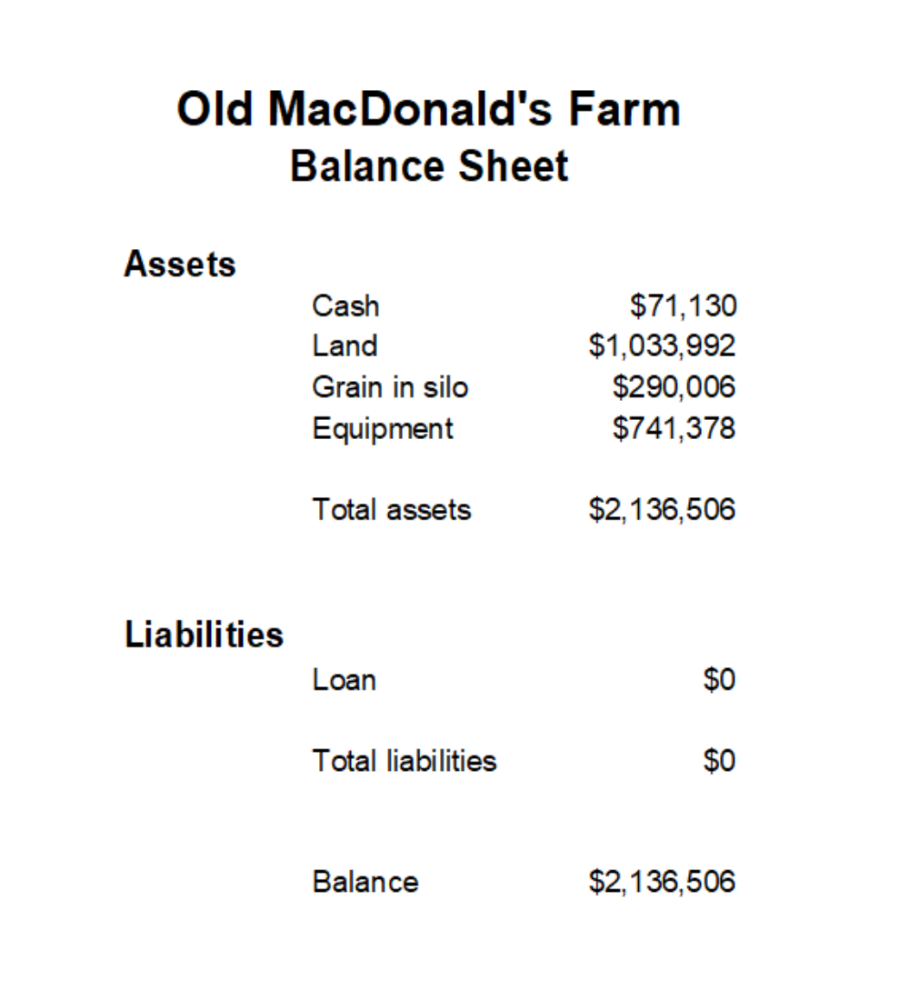
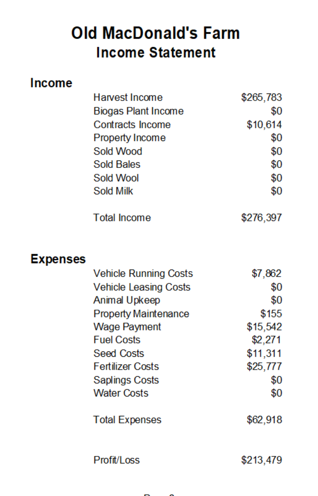
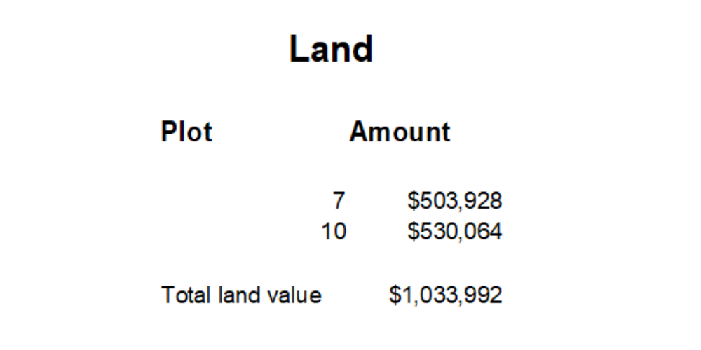
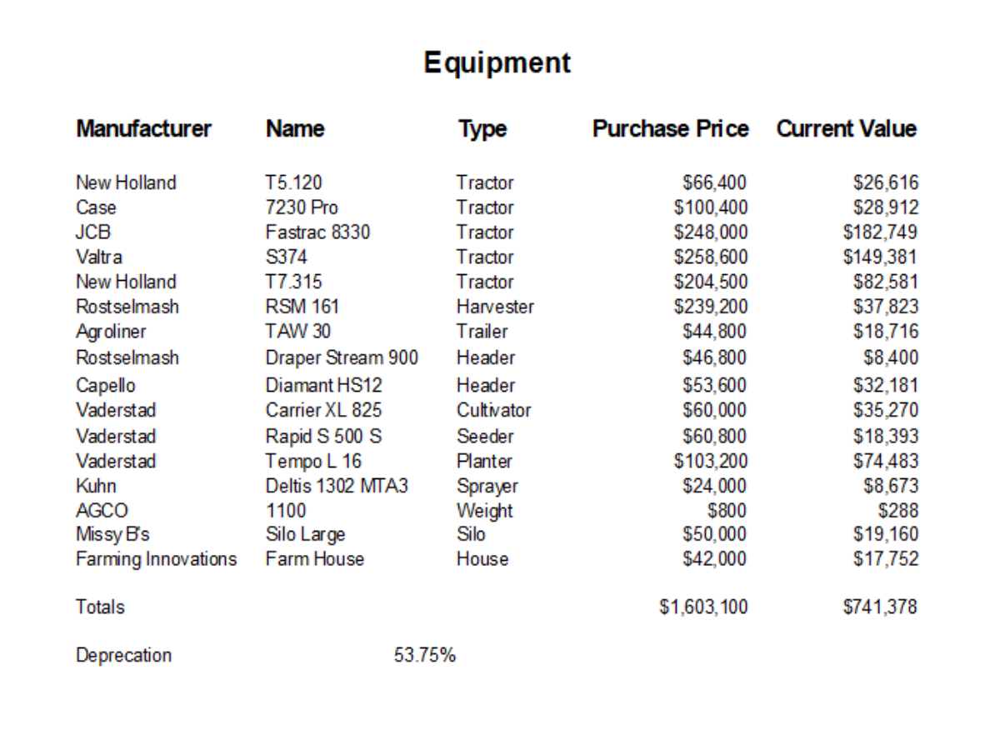
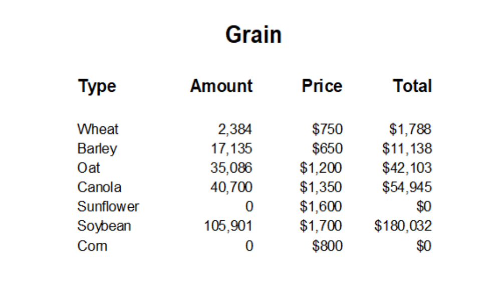
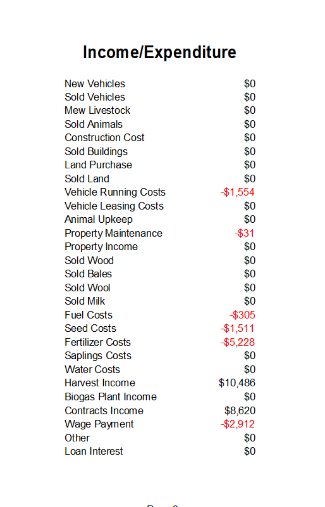

# Farming Simulator 19 Finances

## Introduction

The Finances display in Farming Simulator 19 (FS19) combines assets, liabilities, income, and expenses.  It's difficult to determine where you stand financially.

I created a spreadsheet for my Felsbrunn farm, fields 7 and 10, using Open Office.  I've spent almost 83 hours creating this farm. The base FS19 game involves cultivating, seeding, fertilizing, and finally harvesting.  It takes 36 game hours for your seeds to grow into a ripe field for harvesting.  I have two fields, so I alternate harvesting them.  

The spreadsheet contains two main reports, the balance sheet and the income and expenditures sheet.  The balance sheet shows your assets and liabilities, and the income statement shows your income and expenses.  You would prepare your balance sheet every year or so and your income statement every three months.  The values in these spreadsheets came from game screens.  I have no idea if you can hook up a spreadsheet to the game.  For now, plan on typing values.

Here's the balance sheet for the farm.

The balance sheet lists assets and liabilities.  The balance is the amount of money you would have if you sold everything.  I started with one million dollars and currently have around two million dollars in assets.

Here's the income statement for the farm.

The income and expenses are summed over five days, the number of days shown on the Finances display.  These values are taken from spreadsheet copies of the Finances display.

## Details

Three spreadsheets calculate the values for the balance sheet.

The first is the Land spreadsheet.  The Land spreadsheet totals the different plots that you own.

The second is the Equipment spreadsheet.  The Equipment spreadsheet totals the current value of your equipment.  I have the Buy Used Equipment mod, so all my original prices are the second-hand prices. 
 In FS19, your farm equipment loses value as you use the equipment.  The depreciation percentage is the percentage of how much value your farm equipment has lost.  You can see from the Equipment spreadsheet that your FS19 equipment depreciates rapidly.

The third is the Grain spreadsheet.  The Grain spreadsheet is the amount of grain in your silo times the price you would like to get.

One spreadsheet on five sheets calculates the values for the income statement.  You can have more individual sheets if you want to calculate the income and expenses for a longer time period.

You copy the values from the Finances display on these spreadsheets.  I screen printed the Finances display so I could type the values into the spreadsheet more easily.
